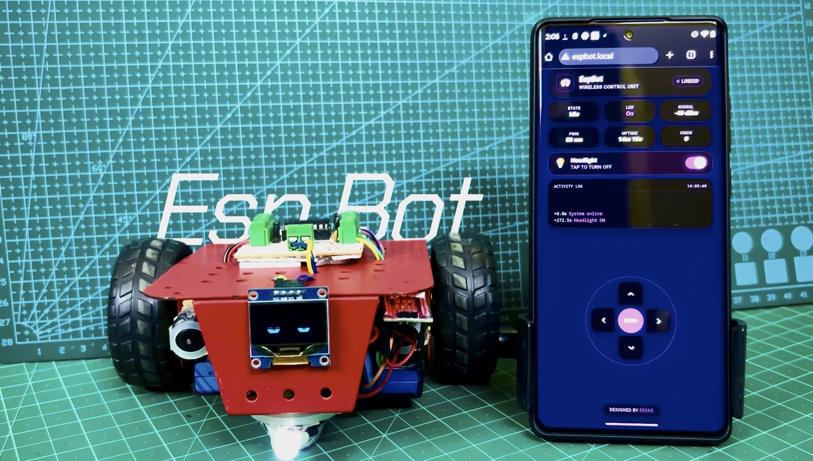

<div align="center">

# EspBot 🤖

**Drive a WiFi robot from any browser using an ESP8266, an iOS-inspired glassmorphic dashboard, and zero app installs.**

[](https://www.espressif.com/)
[]()
[]()
[]()
[](https://www.arduino.cc/)
[](LICENSE)

<br/>



</div>

---

## 📖 Overview

EspBot is a WiFi-controlled robot built around an ESP8266 NodeMCU that serves a full single-page web dashboard directly from flash memory. Connect to the robot's WiFi, open a browser, and drive — no app download, no cloud service, no internet connection required.

The entire interface — HTML, CSS, and JavaScript — lives inside a single `.ino` file as a PROGMEM constant. The browser communicates with the robot through lightweight REST-style fetch() calls, while a server-side watchdog guarantees the robot halts itself if the controller goes silent for more than 600 ms.

---

## ✨ Features

- **Zero-install control:** open any browser on any device → drive the robot
- **iOS-inspired glassmorphic dark dashboard** served entirely from ESP8266 flash
- **Animated boot sequence** with progress bar and status messages
- **Live telemetry grid:** command state · LED status · RSSI · ping · uptime · command count
- **Circular D-pad** with spring animation, purple glow, and haptic feedback
- **LED headlight toggle** with iOS-style switch and real-time state sync
- **Scrolling activity log** with timestamped, color-coded command entries
- **WASD + Arrow + Spacebar keyboard support** for desktop control
- **Pointer events** (mouse, touch, stylus) unified under a single input model
- **About modal** with creator profile, GitHub, LinkedIn, and Instagram links
- **Server-side 600 ms watchdog** auto-stops the robot if the client disappears
- **Client-side emergency stop** via `beforeunload`, `pagehide`, and `visibilitychange`
- **Dual WiFi mode:** STA-first with AP fallback (EspBot_AP / 12345678 / 192.168.9.1)
- **mDNS:** accessible at `http://espbot.local` in either mode
- **Hardware diagnostics routes** for per-pin wiring tests (`/diag/inX/high|low`)
- **Fully responsive:** portrait, landscape, desktop — no scrolling in any orientation

---

## 🔩 Hardware

| Component | Purpose |
|---|---|
| ESP8266 NodeMCU (ESP-12E) | Main controller · WiFi AP/STA · HTTP server · mDNS |
| L293D Dual H-Bridge Board | Drives 2x DC motors via 4 GPIO inputs (direct, no shift register) |
| 2x TT DC Gear Motors | Left and right drive wheels |
| External LED | Headlight controlled via dashboard toggle |
| 4x AA Battery Pack | Single supply powering L293D logic + motor stage |
| Chassis / Wheels | Mechanical platform (any 2WD robot kit) |

---

## 💻 Software

| Dependency | Purpose |
|---|---|
| Arduino IDE 1.8+ / 2.x | Sketch compilation and upload |
| ESP8266 Board Package | NodeMCU board support |

**No external libraries required.** The sketch uses only built-in ESP8266 libraries: `ESP8266WiFi`, `ESP8266WebServer`, and `ESP8266mDNS`.

**Install the ESP8266 board package** — add this URL in Arduino IDE Preferences → Additional Boards Manager URLs:

```
https://arduino.esp8266.com/stable/package_esp8266com_index.json
```

---

## 📁 Project Structure

```
EspBot/
|
+-- EspBot.ino     # Single-file firmware: config, motor control, watchdog,
|                  #   embedded web UI (HTML+CSS+JS in PROGMEM), HTTP routes,
|                  #   WiFi setup (STA+AP), mDNS, diagnostics — 1044 lines
+-- Pic1.jpg       # Hardware photo 1
+-- Pic2.jpg       # Hardware photo 2
+-- Pic3.jpg       # Hardware photo 3
+-- README.md
+-- LICENSE
+-- .gitignore
```

---

## 🔗 Circuit Connections

| L293D Board Pin | Function | NodeMCU Pin | GPIO |
|---|---|---|---|
| IN1 | Motor 1 direction A | D1 | GPIO5 |
| IN2 | Motor 1 direction B | D2 | GPIO4 |
| IN3 | Motor 2 direction A | D6 | GPIO12 |
| IN4 | Motor 2 direction B | D7 | GPIO13 |
| EN1 | Motor 1 enable | Jumper cap (always on) | — |
| EN2 | Motor 2 enable | Jumper cap (always on) | — |
| Power (+/−) | Battery input | 4x AA pack | — |
| GND | Common ground | NodeMCU GND | — |
| — | Status LED | D0 | GPIO16 |

**Direction Logic:**

| Command | IN1 | IN2 | IN3 | IN4 | Result |
|---|---|---|---|---|---|
| Forward | LOW | HIGH | LOW | HIGH | Both motors forward |
| Backward | HIGH | LOW | HIGH | LOW | Both motors reverse |
| Left (pivot) | LOW | HIGH | HIGH | LOW | Tank-turn left |
| Right (pivot) | HIGH | LOW | LOW | HIGH | Tank-turn right |
| Stop | LOW | LOW | LOW | LOW | All coasting |

> **Note:** EN1/EN2 are physical jumper caps on the L293D board, not GPIO-controlled. Both must be installed for the motor channels to be active. No PWM speed control — full speed only.

---

## ⚙️ Installation

**1. Clone the repository**

```bash
git clone https://github.com/MohammadFayasKhan/EspBot.git
cd EspBot
```

**2. Add ESP8266 board support**

In Arduino IDE → Preferences → Additional Boards Manager URLs, add:

```
https://arduino.esp8266.com/stable/package_esp8266com_index.json
```

Then: Tools → Board → Boards Manager → search `esp8266` → Install

**3. Configure WiFi credentials**

Edit the `Config` namespace at the top of `EspBot.ino`:

```cpp
constexpr const char *STA_SSID     = "YOUR_WIFI_SSID";
constexpr const char *STA_PASSWORD = "YOUR_WIFI_PASSWORD";
```

If STA connection fails within 8 seconds, the robot automatically starts its own AP:
- **SSID:** `EspBot_AP`
- **Password:** `12345678`
- **IP:** `192.168.9.1`

**4. Select board and port**

```
Tools → Board      → NodeMCU 1.0 (ESP-12E Module)
Tools → Port       → /dev/cu.usbserial-XXXX  (macOS) | COM# (Windows)
```

**5. Upload**

```
Sketch → Upload   (Ctrl + U / Cmd + U)
```

**6. Open Serial Monitor**

```
Tools → Serial Monitor → 115200 baud
```

You will see the assigned IP address printed on boot.

---

## 🚀 Usage

1. Power on the robot (4x AA batteries + USB to NodeMCU).
2. Connect your phone/laptop to the WiFi (home network or `EspBot_AP`).
3. Open a browser and navigate to:
   - The IP shown in Serial Monitor, **or**
   - `http://espbot.local` (mDNS)
4. Drive:

```
Touch/Mouse:     Tap and hold D-pad buttons → robot moves
                 Release → robot stops instantly

Keyboard:        W / ↑ → Forward
                 S / ↓ → Backward
                 A / ← → Left
                 D / → → Right
                 Space → Emergency Stop

LED:             Tap the headlight toggle row → LED on/off
```

> **Safety:** Closing the browser tab, switching apps, or losing WiFi triggers an automatic emergency stop via `sendBeacon('/stop')`. The server-side watchdog independently halts the robot after 600 ms of silence.

---

## 🧠 How It Works

**Single-File Architecture**
The entire project — firmware, web dashboard, and communication layer — lives in one `.ino` file. The HTML/CSS/JS dashboard is stored as a PROGMEM constant string (~35 KB) and served directly from flash on every `GET /` request. No SPIFFS, no external CDN, no framework.

**REST-Style Control**
The browser sends `fetch()` requests to simple endpoints: `/forward`, `/backward`, `/left`, `/right`, `/stop`, `/led/on`, `/led/off`, `/status`. Each motor command handler writes GPIO pins directly via `digitalWrite` and resets the watchdog timer. Responses are minimal (`"OK"`) to keep latency under 5 ms per cycle.

**Heartbeat + Watchdog**
While a D-pad button is held, the client sends the active command every 250 ms as a heartbeat. The server-side watchdog checks every `loop()` iteration: if no command has been received for 600 ms, it forces all motors to stop. This dual-layer failsafe (client `sendBeacon` + server watchdog) ensures the robot never runs away.

**Glassmorphic Dashboard**
The UI uses an iOS-inspired dark theme with `backdrop-filter: blur()`, subtle purple glows, spring-animated D-pad buttons, a live activity log, and a 6-cell telemetry grid. The boot sequence animates a progress bar and status messages before revealing the main interface. Everything is CSS — no images, no icons fonts, no external assets.

**Dual WiFi Strategy**
On boot, the ESP8266 attempts STA mode (joins your home WiFi). If it fails after 16 attempts (~8 seconds), it falls back to AP mode, creating its own network. mDNS registers `espbot.local` in either mode.

---

## 🌐 API Reference

| Route | Method | Response | Description |
|---|---|---|---|
| `/` | GET | HTML page | Serves the full dashboard |
| `/forward` | GET | `OK` | Both motors forward |
| `/backward` | GET | `OK` | Both motors reverse |
| `/left` | GET | `OK` | Tank-pivot left |
| `/right` | GET | `OK` | Tank-pivot right |
| `/stop` | GET | `OK` | All motors off |
| `/led/on` | GET | `OK` | Turn headlight on |
| `/led/off` | GET | `OK` | Turn headlight off |
| `/led/toggle` | GET | `OK` | Toggle headlight |
| `/status` | GET | JSON | `{command, led, rssi, uptime, ip, clients}` |
| `/diag/inX/high\|low` | GET | Text | Direct pin control for wiring tests |
| `/diag/all/off` | GET | Text | All motor pins LOW |

---

## 🖼️ Screenshots

<div align="center">
<table>
  <tr>
    <td align="center" width="50%">
      
      <p align="center"><b>Web Dashboard</b><br/><sup>iOS-inspired glassmorphic dark theme with live telemetry</sup></p>
    </td>
    <td align="center" width="50%">
      
      <p align="center"><b>Robot Hardware</b><br/><sup>ESP8266 NodeMCU + L293D + TT motors + battery pack</sup></p>
    </td>
  </tr>
</table>
</div>

---

## 🤝 Contributing

1. Fork the repository
2. Create a feature branch: `git checkout -b feature/your-feature`
3. Commit your changes: `git commit -m 'feat: description'`
4. Push and open a Pull Request

---

## 📄 License

MIT License. See [LICENSE](LICENSE) for details.

---

## 👤 Author

**Mohammad Fayas Khan**

GitHub → [MohammadFayasKhan](https://github.com/MohammadFayasKhan)

*Built for learning, experimentation, and embedded systems exploration.*
